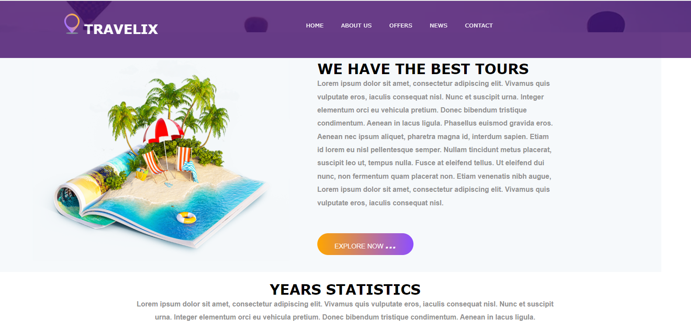

# Travelix-Clone
This repository is for developing the Travelix clone.

# What is Travelix?

Travelix. Home; Flights; Hotels; Car Rental; Taxi; Tour; Cruises; shop; Blog; Discover The World For Less. Save up to 60% on hotels and flights worldwide. For Offline Best Available Fare Whats App Below Scan. CLICK HERE Popular Destinations Need travel inspiration? Check out our most popular destinations. Chennai. Mumbai. Delhi. Hyderabad. Dubai. Sharjah. Abu Dhabi.

## Tech Stacks Used:
 
- **HTML**
- **CSS**
- **JavaScript**

### **Index Page:**

about index
// link of indexpage

### **About Us:**

about about-us

### **Offer:**

about offer

### **News:**

about news page

### **contact us:**

about contact uspage

## Features

* A static clone of Travelix
 

## Limitations

* responsive for all device

 

## Contributers

 👤 **MD Amanullah**

- Github: [MD Amanullah](https://github.com/Amanullah21)
- Linkedin: [MD Amanullah
](https://www.linkedin.com/mwlite/in/md-amanullah-0239691798)

👤 **Suraj Himanshu**

- Github: [Suraj Himanshu](https://github.com/surajhimanshu)

👤 **Utkash Vaibhav**

- Github: [Utkash Vaibhav](https://github.com/UtkarshVaibhav)
- Linkedin: [Utkash Vaibhav](https://www.linkedin.com/in/utkarshvaibhav233)
